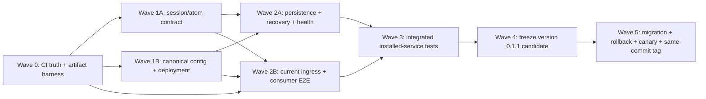

# Issue #34 正確原子化 Release Implementation Plan

> **Execution mode:** 由 master agent 維護 integration branch 與 todo/boundary；worker 一律使用 Codex 內建 subagent + 獨立 worktree/branch，不使用 coordinator skill。若執行介面可選模型，短生命週期 worker 優先使用 `gpt-5.3-codex-spark`；不可選時照實記錄，不宣稱已指定模型。

**Goal:** 交付 `paulsha-hippo 0.1.1`，讓 installed Hippo 的 hook + dream service 能把真實 CLI session 正確保存為語意原子筆記：原始經驗不被 title generation 覆寫、title/project/provenance 正確、note 可通過 MOC/index/recall，並能從 Issue #34 的 current/stale deployment profiles 安全升級與恢復。

**OpenSpec:** `openspec/changes/issue-34-atomization-release/`

**Release rule:** 本 repo `flat` profile 對這個 feature batch 使用 PATCH `0.1.1`。Final untagged candidate commit 必須先完成 `0.1.1` version、正式 changelog、docs 與 strict-valid active OpenSpec，再以 commit SHA + wheel SHA-256 識別；所有 artifact/upgrade/rollback/canary gate 跑這一顆 wheel。版號規範不接受 `-rc`，因此不得建立 `v0.1.1-rc.*`；通過後只把 `v0.1.1` tag 加到同一 commit，不改檔、不 rebuild。Evidence 完成後再用官方 OpenSpec archive 做 post-tag metadata closeout。

**Scope stop:** 本 plan 停在 implementation/release 規格。撰寫 plan 時不得 probe 真 backend、requeue、cleanup、重啟服務、修改 runtime、commit、push、開 PR 或發 release。

## Tasks

以下 numbered sections 與 OpenSpec `tasks.md` 共同構成本 accepted implementation plan；執行狀態以 OpenSpec checklist 為準。

## 2026-07-22 architecture amendment — Issue #39

本 amendment 取代本 plan 中任何 Hippo direct HTTP/provider API-key 管理、Gemma TCP side channel 或 prompt-in-argv 的暗示。Issue [#39](https://github.com/hamanpaul/paulsha-hippo/issues/39) 與 active OpenSpec 為這部分的規格 authority：

- Hippo 只管理外部 headless CLI profiles，不保存 provider API key、credential env-name、OAuth、secret path、provider base URL，也不直接呼叫 provider HTTP/SDK。`claude`、`codex`、`agy`、`cg`、`co-gem`、`claude-gem` 一律視為 repo 外 agent/launcher。Legacy source 的任一 prohibited direct-provider field 若含非空值，migration 必須 BLOCKED 且不 backup/copy/apply，先由 operator 在 Hippo 外去敏。
- Default route 為 Tier 1 `claude`/`codex`、Tier 2 `agy`/`cg`、Tier 3 `co-gem`/`claude-gem`/custom local；同 tier 使用明確 priority。Traits、task classes、model、profile-specific effort 與 argv 都是每 profile 宣告欄位。
- Prompt 只走 stdin；command 用 `shell=False` token list，只允許經 allowlist 驗證的 `{MODEL}`/`{EFFORT}` 完整 token。Child process 只取得固定 minimal non-secret env，不繼承 `os.environ`；env credential 需求由外部 launcher 自行處理。`.bashrc` alias 不能供 systemd 使用；`cg` 必須另有外部 executable launcher。Dream 禁止 `--yolo`、`--autopilot`、permission bypass、tool/MCP/custom-instruction/user-interaction/remote-enabled profiles。
- Fallback 是 bounded、acyclic、可觀測 state machine：整個 session attempt 固定一個 profile，切換時從 frozen input 重跑；CLI-native fallback 必須關閉；有 global deadline/attempt/call budget、circuit breaker。Cache identity 包含 task class、response schema、router contract 與 profile/model/effort/command/config/skill/prompt。備援成功標 `degraded-success`，全鏈耗盡才 park 一次。
- Release install 增加 ownership-manifest-driven `hippo install all --force --dry-run|--force`。它只能清理 manifest/legacy allowlist 證明由 Hippo 擁有的退休設定與檔案，必須 backup/rollback/idempotent，且永不觸碰記憶資料、ledger/index/recovery、project registry、shell rc、外部 launcher 或 OAuth/API-key stores。Shared config 只保存 whole-file hash 與 Hippo-owned inverse patch，不複製整檔，rollback 只做 owned-entry three-way compensation並保留並行使用者修改。
- Timer/load-gating 部分依目前 hourly timer + load/memory gate 繼續觀察，本次不修改 timer 或 Issue #38。

---

## 1. Evidence-backed diagnosis

### 1.1 Current code/runtime facts

- `.github/workflows/tests.yml:24` 同時 `ls tests/test_*.py tests/*_test.py`；第二個 glob 無匹配令 detection 失敗，所以 setup/install/pytest 全 skip。`:41` 的 install fallback 又以 `|| true` 吞錯。近期綠燈不是 test proof。
- `paulsha_hippo/importer/title.py:146-166` 把生成 title 寫回 `assistant_summary`；`importer/frontmatter.py:103-115` 再同時用它作 frontmatter title 與 `## Summary`，原始 assistant outcome 可能在 atomize 前遺失。
- `atomizer/slice_frontmatter.py:107-108` 只寫 `atom_title`；`moc/naming.py:61-72` 不讀 `atom_title`，fallback 成 `<artifact_kind>-<project>`；`moc/linker.py:71-72` 再把 generic stem 寫回 canonical title。
- `atomizer/cli.py:38-54` 與 `atomizer/llm_output.py:231-235` 用 path-component 規則拒絕 registry 合法的 rich project ID；filesystem sanitize 與 metadata validation 混在一起。
- `moc/naming.py:49-58` 限制 final name 到 NAME_MAX，但 `moc/frontmatter_io.py:98-103` 以 `.<full-name>.tmp` 更新，合法 255-byte target 仍會 `ENAMETOOLONG`。
- `atomizer/config.py:117-131,237-270` 正常 runtime 讀 packaged config + legacy override；canonical Hippo config 並不控制 atomizer。`ops.py:160-215` 又同時生成兩份設定。
- `atomizer/agent_exec.py:38-56` non-zero 只保留 exit code，stderr 被丟棄；config model label 未傳給 custom CLI，processing 裡的 model 不等於 observed model。
- `dream/cli.py:146-159` 即使 orchestrator partial/failed 仍 exit 0；`ledger/dream.py:85-106` 的 backlog 只數 raw inbox，漏掉 split/parked。
- current profile 已存在 service package 與 hook venv/package 不同 build 的 split deployment；只清 legacy lock 會立即復發。
- current profile 最近仍能寫一張 note，但該 note 同時為 `_unknown`、generic-title 且不在 index。這證明「有檔案」與「正確可用原子筆記」不是同一成功條件。

### 1.2 ProblemMap route

```text
Primary family:   F4 Execution & Contract Integrity
Secondary family: F5 Observability & Diagnosis
Broken invariant: execution_skeleton_closure_broken
PM1 route:        #15 deployment deadlock (high)
                  #14 bootstrap ordering (medium)
                  #8 debugging black box (medium)
Global fix:       deployment-deadlock.md
```

Fix ordering therefore是：先恢復 CI/test truth與資料契約，再 canonicalize config/deployment，才允許 recovery；最後以 installed-service canary 閉合 release。不能先對 production backlog 大量 requeue。

### 1.3 Definition of a correct atom

每張 release-accepted atom 必須同時滿足：

1. body 含來源 session 的實質經驗，不是生成 title 的複本，也不洩漏不必要 raw transcript；
2. 一張 note 只承載一個可復用概念，固定 semantic corpus 的預期概念無漏失；
3. canonical `title` 是 LLM proposal 的具體標題，且不命中 `is_generic_title`；
4. canonical project 等於 source/registry 可證明的 rich ID；只有確實未知才可 `_unknown`；
5. frontmatter/checksum/slice ID 合法，distiller provenance 誠實區分 requested 與 observed；
6. MOC/linker 不改壞 title/project，metadata index 與 FTS 都能找到該 slice；
7. ledger 可由 run/session/slice ID 追到 hook ingress、processing 與 publication；
8. service run 的 machine-readable health 為 `ok`，不是只看 systemd exit 0。

---

## 2. Issue #34 traceability

| # | 現行缺口 | Code / migration deliverable | Release evidence |
|---|---|---|---|
| 1 | offered 後 read/applied 為零 | installed consumer E2E；驗 hook attribution與 shortlist instruction；不偽造 applied | 同 session 的 offered → actual Read；applied 僅真 structured ack |
| 2 | dream 永遠 partial | 完整 health oracle；修 3/4/7；run-level disk/index reconciliation | 連續 3 個 scheduled cycle `ok` |
| 3 | legacy/NAME_MAX linker | short unique temp basename；legacy rename manifest | exact-NAME_MAX test + current profile migration 無 warning |
| 4 | parked/split exit 1 | bounded sanitized stderr；backend gate；batch recovery | root cause evidence + parked/split 無非預期增長 |
| 5 | backend 三真源/model 假 provenance | canonical config、legacy migration、requested/observed provenance、atomic surface attestation | service-effective probe + config/build/provenance report |
| 6 | generic title、`_unknown`、summary loss | session title/summary 分離；canonical atom title；rich project/path boundary；historical dry-run repair | semantic corpus + historical migration manifest |
| 7 | malformed inbox 重複 warning/backlog 誤算 | durable quarantine；raw/split/retrying/parked/quarantine census | 同一 poison 只隔離一次，後續 run 不重複 warning |
| 8 | Copilot ingress 斷鏈 | 同時支援 current `session-state/<sid>/events.jsonl` 與 legacy layout；重裝 hooks | 真 Copilot hook → import → atom；不可只用舊 fixture |
| 9 | legacy per-session locks | 先 attested hook upgrade，再 cleanup；不重寫 shard-lock | cleanup before/after manifest，後續無新 legacy lock |
| 10 | assistant outcome 截斷/遺漏 | `assistant_messages[]` 完整有序保留，last non-empty 映射 `assistant_summary` | Claude/Codex/Copilot multi-output 與 >2,000 字 fixtures |
| 11 | capture/hash 誤去重 | `capture_id`、`parent_session_id`、完整 semantic hash、title-input hash | retry/capture/content/key-order matrix |
| 12 | provider-context boundary / 大 session 整批超限 | 12K input + 2K output + 48 KiB gate，ordered chunking 與 fragment coverage | 32,767/32,768/32,769/262,144 與 ~53K corpus |
| 13 | `promoted, slices=0` | canonical disposition wrapper 與 terminal `no-findings` | empty/noise/invalid/no-findings matrix，zero-slice promoted = 0 |
| 14 | backfill 不可重啟/回滾 | `hippo recovery plan|apply|resume|rollback` hash-pinned journal | commit-point fault injection + byte-equivalent resume/rollback |

所有 implementation/release PR 若引用 `#34` 都先使用白名單 `policy-exempt:issue-link`，理由為「umbrella issue 保留至 tag + live consumer evidence」，不可發明新 exemption label。`v0.1.1` producer artifact 可在 auto-consumption capability 降級後發布；只有 tag、九項 evidence 與真 offered → Read 都完成時，才以 evidence comment 關閉 Issue #34。

---

## 3. Multi-agent boundaries and merge topology

### 3.1 Branch/worktree contract

- Master integration branch: `feature/34-atomization-release`
- Worker branches:
  - `wt/34-atomization-release/ci-artifact`
  - `wt/34-atomization-release/atom-contract`
  - `wt/34-atomization-release/deployment-config`
  - `wt/34-atomization-release/persistence-recovery`
  - `wt/34-atomization-release/ingress-e2e`
- 每個 worker 開始前由 master 傳 task envelope：goal、allowed files、forbidden files、required tests、output commit。
- Worker 若發現必須改 forbidden/shared file，立即停止該寫入並回報；shared wiring 由 integration node 處理。
- Master 只 merge 明確列出的 commit，merge 後跑該 wave integration gate；未綠不得派下一個 dependent wave。
- 所有 worker 使用 Codex built-in subagent；不透過 coordinator skill。短 task 優先配置 `gpt-5.3-codex-spark`（若產品介面可選），reviewer 與 integrator仍須獨立重驗。

### 3.2 File ownership

| Worker | Primary write scope | Must not edit |
|---|---|---|
| ci-artifact | `.github/workflows/tests.yml`, build/version helper, artifact harness/tests | importer/atomizer/moc runtime logic |
| atom-contract | `importer/{title,frontmatter}.py`, atomizer prompt/output/frontmatter/pipeline, `moc/naming.py`, focused tests | config loader, ops/deploy, workflow |
| deployment-config | `atomizer/config.py`, `paths.py`, `ops.py`, hooks installer/systemd assets, new deployment/config modules, focused tests | importer semantic fields, MOC/recovery |
| persistence-recovery | `moc/frontmatter_io.py`, linker/recovery/ledger/dream health modules, recovery tests | hooks/session readers, workflow |
| ingress-e2e | `lib/session_readers.py`, hook adapters/assets, installed ingress/consumer harness, capability docs | atom semantic implementation, recovery |
| integration node | `cli.py`, shared package exports, README/ops docs, changelog fragment, final conflict resolution | unrelated repo files |

`atomizer/pipeline.py` 是 shared hotspot：Wave 1 的 atom-contract 先擁有；Wave 2 合併後才由 persistence-recovery 加 provenance/health plumbing。禁止兩個 active worktree 同時改它。

### 3.3 Dependency DAG



Wave 1A/1B 可平行；Wave 2A/2B 在前置 merge 後可平行。這是最大安全平行度；把 recovery 提前會重播舊 backend/config 問題。

---

## 4. Global implementation invariants

- Test-first：每個 behavior 先新增會失敗的 regression，確認正確失敗原因，再做最小實作。
- Runtime 零 secret：stderr、config/provenance、manifest 需去 credential、control characters、完整 private endpoint 與個人 executable path。
- Append-only ledgers 不 rewrite/truncate；migration 只 append evidence 或以外部 manifest 描述 mapping。
- 不刪 raw session/knowledge body；quarantine/rename/retitle/reattribute 均先 dry-run + SHA-256 manifest。
- Canonical project ID 不等於 directory name；slice ID 不因 filename repair 被截斷。
- Custom argv 沒有可驗證 response model時，observed model 是 `unknown`/`unverified`。
- `processing=promoted` 只表示 per-session semantic/integrity gate通過；dream `ok` 還需 run-level MOC/index reconciliation。
- 每個 code batch 新增 `changelog.d/issue-34-<batch>.md`；freeze final candidate 前封版為 `CHANGELOG.md [0.1.1] - <release-date>` 並重建空的 `[Unreleased]`，不在較早 batch bump VERSION。
- 所有 branch/PR/comment/commit採 zh-TW conventional-commit；shareable docs只用 repo相對路徑、`~`、`<tmp>`、profile aliases。

---

## 5. Wave 0 — Restore CI truth and artifact identity

### Task 0.1: Make pytest impossible to false-skip

**Files**

- Modify: `.github/workflows/tests.yml`
- Create: `tests/test_ci_workflow_contract.py`

**RED**

- Test parse workflow text/YAML and assert:
  - repo with `tests/test_*.py` cannot set `has_tests=false` because another glob is absent;
  - install command contains no error-swallowing `|| true`;
  - pytest/collection step is unconditional for this established repo;
  - workflow reports a positive collected count.
- Run: `python3 -m pytest tests/test_ci_workflow_contract.py -v`
- Expected: fail against current `ls ... tests/*_test.py` and `|| true`.

**GREEN**

- Remove the template-era detect/conditional steps entirely: this repo already owns a test suite.
- Install `.[test]` once and fail normally.
- Run `python -m pytest --collect-only -q` followed by `python -m pytest tests/ -q`; explicitly fail zero collection.
- Do not hard-code a historical test count; record count from the run output.

**Gate**

```bash
python3 -m pytest tests/test_ci_workflow_contract.py -v
python3 -m pytest --collect-only -q
python3 -m pytest tests/ -q
```

### Task 0.2: Establish release/build/surface identity

**Files**

- Create: `paulsha_hippo/build_info.py`
- Create: `scripts/build_release_artifact.py`
- Create: `tests/test_build_info.py`
- Modify: `tests/test_version_consistency.py`, `tests/test_cli.py`
- Later integration: `paulsha_hippo/cli.py`, `paulsha_hippo/ops.py`

**Contract**

- `hippo --version --json` (or an equivalent machine-readable subcommand) returns package version + build commit + install root.
- Build script creates a candidate wheel and sidecar manifest `{version, commit, wheel_sha256, built_at}`. Wheel SHA lives in the sidecar/deploy manifest, not recursively inside the wheel.
- Package/hook/service attestation returns the same build commit; unknown source checkout state is explicit, never guessed.
- Version consistency test covers `VERSION`, `pyproject.toml`, root package and `importer/__init__.py`.

**RED/GREEN**

1. Add tests showing importer version is currently unverified and two `0.1.0` installs cannot be distinguished.
2. Implement build info and CLI data contract without在 Wave 0 bump `0.1.0`。
3. Build a development wheel from a clean commit to verify manifest SHA against `sha256sum`; this is harness proof, not the final release candidate.

### Task 0.3: Build checkout-independent installed harness

**Files**

- Create: `tests/installed/conftest.py`
- Create: `tests/installed/test_wheel_clean_install.py`
- Create: `tests/installed/test_surface_attestation.py`

**Requirements**

- Build wheel via `python -m pip wheel . --no-deps --wheel-dir <tmp>/dist`.
- Install into a fresh venv/HOME, then change cwd outside the repo before importing/running `hippo`; this prevents checkout shadowing.
- Verify package data includes hooks, YAML, service/timer, skills/docs required at runtime.
- Do not start a real user timer in CI; installed tests use isolated dirs/fake systemctl boundary.

### Task 0.4: Close policy bootstrap gaps

**Files / external prerequisite**

- Create: `.github/pull_request_template.md` with the canonical policy checklist.
- Before the version-freeze PR, an authorized maintainer applies the policy-recognized `release:patch` label; absence of authority is a release blocker, not a reason to invent an exemption.
- Add a policy fixture/check proving the version-freeze PR supplies that release label while `VERSION` temporarily differs from the latest tag.

**Wave 0 merge gate**

```bash
python3 -m pytest tests/test_ci_workflow_contract.py tests/test_build_info.py \
  tests/test_version_consistency.py tests/installed -v
python3 -m pytest tests/ -q
python3 -m policy_check --repo .
```

---

## 6. Wave 1A — Preserve experience and publish semantic atoms

### Task 1.1: Split session title from immutable assistant summary

**Files**

- Modify: `paulsha_hippo/importer/title.py`
- Modify: `paulsha_hippo/importer/frontmatter.py`
- Review adapters/normalization types that construct session dicts
- Modify: `tests/test_title.py`, `tests/test_adapter_content.py`
- Create/modify focused frontmatter round-trip tests

**RED**

- Adapter fixture supplies `assistant_summary="resolved root cause X"`; title runner returns `"Fix X"`.
- Assert normalized session/inbox has `session_title="Fix X"`, title metadata `Fix X`, and body summary still `resolved root cause X`.
- Assert cached title path has the same behavior.
- Flip the existing test that currently expects generated title to replace Summary.

**GREEN**

- Introduce canonical `session_title` field; title cache stores only title/source.
- Never assign generated title to `assistant_summary`.
- Renderer uses `session_title` for title metadata and `assistant_summary` for semantic body.
- Backward reader tolerates old sessions with no `session_title`; it may derive display title but must not invent semantic summary.

### Task 1.2: Carry proposal title through note → MOC → index

**Files**

- Modify: `paulsha_hippo/atomizer/slice_frontmatter.py`
- Modify: `paulsha_hippo/moc/naming.py`
- Modify as needed: `paulsha_hippo/moc/linker.py`, `paulsha_hippo/atomizer/pipeline.py`
- Modify: `tests/test_moc_naming.py`, `tests/test_moc_linker.py`, `tests/test_atomizer_e2e.py`
- Create: `tests/test_atom_publication_e2e.py`

**RED**

- Full fake-LLM fixture returns a concrete title.
- Run proposal → knowledge write → MOC name/link → index.
- Assert canonical title and filename stem derive from proposal, not `report-<project>` fallback; slice appears in metadata + FTS.

**GREEN**

- Writer sets canonical `title=proposal.title` and compatibility `atom_title`.
- Naming order: `title` → `atom_title` → first heading → neutral fallback.
- Linker must not overwrite a valid semantic title with derived generic stem.

### Task 1.3: Enforce title quality before promotion

**Files**

- Modify: `paulsha_hippo/atomizer/pipeline.py`, promoter/prompt as required
- Reuse: `paulsha_hippo/noise.py:is_generic_title`
- Modify: pipeline/park/requeue tests

**Behavior**

- Specific title passes once.
- Generic proposal triggers at most one title-only repair through the same canonical backend/config.
- Repair uses a separate versioned cache namespace/key over `{session_atom_cache_key, proposal_index, original_title, prompt_hash, config_hash, skill_hash}`; it may only immutable-replace the title on a copied proposal.
- The repair call belongs to the same promotion attempt. Cache hit/miss, repair result and provenance are recorded; config/skill/prompt changes invalidate the cache. It must not reuse the full-proposal cache key and replay the generic output.
- Still generic → no note from that session; failure goes through existing bounded retry/park taxonomy.
- Raw output/prompt remains absent from log/evidence.

### Task 1.4: Separate rich project identity from filesystem key

**Files**

- Modify: `paulsha_hippo/atomizer/cli.py`, `llm_output.py`, `llm_promoter.py`, `prompt.py`, `pipeline.py`
- Reuse/modify: importer project resolver/registry interfaces
- Create: `tests/test_project_identity_e2e.py`

**Contract**

- Registry-valid rich project ID stays exact in frontmatter/ledger.
- `_knowledge_path_for` uses `readable-prefix--p-<canonical-id-hash>` (with a documented hash length) only at filesystem boundary, so legacy sanitizer collisions stay distinct.
- Known source project is authoritative; LLM mismatch is recorded, not accepted.
- Only `_unknown` source may use union of legacy + generated registries.
- Managed install enables/refreshes registry producer later in Wave 1B; parser default need not silently flip globally.
- Add the collision pair `github.com/a/b` vs `github.com__a__b`, registry round-trip and historical path migration-map tests.

### Task 1.5: Make per-session publication recoverably atomic

**Files**

- Create: `paulsha_hippo/atomizer/publication.py`
- Modify: `paulsha_hippo/atomizer/pipeline.py`, processing/relations eligibility readers
- Create: `tests/test_atom_publication_transaction.py`

**Transaction contract**

1. Validate every proposal before visible writes.
2. Write/fsync all note files in same-filesystem session staging.
3. Append/fsync `publish_prepare` with publication ID, target/checksum/slice IDs and relation set.
4. Materialize targets; atoms carrying a publication ID remain ineligible for MOC/index until a matching commit marker exists.
5. Append relation edges idempotently keyed by publication ID, then append `publish_commit`/`processing=promoted` once.
6. At every new run, recover incomplete journals before processing new sessions: finish or roll back prepared artifacts without losing raw input or duplicating notes/edges.

Tests inject failure at the Nth staged write, target rename, edge append and final commit, then rerun and assert one complete atom set or zero eligible atoms—never a partial searchable session.

**Wave 1A gate**

```bash
python3 -m pytest \
  tests/test_title.py tests/test_adapter_content.py \
  tests/test_moc_naming.py tests/test_moc_linker.py \
  tests/test_atomizer_e2e.py tests/test_atom_publication_e2e.py \
  tests/test_project_identity_e2e.py tests/test_atom_publication_transaction.py -v
```

---

## 7. Wave 1B — Canonical config, truthful provenance, atomic deployment

### Task 1B.1: Define canonical distiller config and migration

**Files**

- Create: `paulsha_hippo/config_migration.py`
- Modify: `paulsha_hippo/atomizer/config.py`, `paulsha_hippo/paths.py`, `paulsha_hippo/ops.py`
- Modify samples/docs
- Create: `tests/test_config_migration.py`
- Modify: `tests/test_atomizer_config.py`, `tests/test_ops.py`

**Migration matrix**

| Canonical | Legacy | Expected |
|---|---|---|
| valid, same semantics | present | migrate/retire legacy, zero conflict |
| valid, conflicting | present | dry-run conflict; apply blocked until hash-bound resolution file selects `canonical`, `legacy`, or manual value per field with rationale |
| retired direct-provider fields | any | report/remove only through reviewed migration; validation failure before processing |
| absent | valid legacy | create canonical from explicit plan + backup |
| bare argv unresolved in service env | any | blocked until resolved absolute launcher/dependencies |
| already migrated | retired/absent | second apply zero semantic diff |

Normal runtime reads only canonical config. Legacy path remains readable solely inside migration planner. Resolution manifest records both input hashes, every selected field/source/reason and an overall plan hash; apply rejects any source drift after review. This makes the known current-profile conflict executable instead of a permanent dead end.

### Task 1B.2: Add honest distillation provenance and error evidence

**Files**

- Create: `paulsha_hippo/atomizer/provenance.py`
- Modify: `paulsha_hippo/atomizer/agent_exec.py`, `llm_promoter.py`, response cache schema
- After Wave 1A merge, modify: `atomizer/slice_frontmatter.py`, `atomizer/pipeline.py`, processing ledger serializer/reader
- Create/modify: `tests/test_distillation_provenance.py`, `tests/test_agent_exec.py`, cache/round-trip/publication E2E tests

**Provenance schema**

```yaml
distiller:
  profile_id: <id>
  profile_revision: <revision>
  tier: <1|2|3>
  attempt_index: <n>
  requested_model: <configured-or-null>
  requested_effort: <configured-or-null>
  observed_model: <verified-response-value-or-null>
  model_verification: verified | unverified | unavailable
  command_fingerprint: <sha256-prefix>
  fallback_reason: <category-or-null>
  config_hash: <sha256>
  skill_hash: <sha256>
  hippo_version: <version>
  build_commit: <commit-or-unknown>
```

- Fingerprint is derived from normalized non-secret command identity, not raw personal path.
- Non-zero subprocess evidence: exit code + fixed-size sanitized stderr tail. Strip ANSI/control chars and credential patterns; never store prompt/stdout.
- Replace the string-only agent response with an `AgentRunResult` carrying profile/tier/attempt, requested model/effort, observed model verification, command fingerprint, elapsed time, failure category, and fallback reason. External CLI output remains unverified unless it contains authenticated model evidence.
- Cache schema stores the normalized result/provenance contract and keys by profile revision/model/effort/command/config/skill/prompt hashes, not just text. Cache replay cannot cross profiles or upgrade unverified model identity to verified.
- `slice_frontmatter.render()` serializes the `distiller` map, parser/validator round-trips it, and `processing.append()` writes the same provenance identity. E2E asserts both records match while containing no raw command path, prompt, credential env-name, secret path, or credential.

### Task 1B.3: Treat package/hooks/service as one deployment

**Files**

- Create: `paulsha_hippo/deployment.py`
- Modify: `paulsha_hippo/ops.py`, `paulsha_hippo/hooks/install.sh`, systemd templates/assets
- Integration: top-level `cli.py`
- Create: `tests/test_deployment_plan.py`, `tests/test_deployment_rollback.py`
- Extend installed surface tests

**Command contract**

```text
<staged-venv>/bin/hippo upgrade plan    --memory-root ... [--resolution-file ...] [--json]
<staged-venv>/bin/hippo upgrade prepare --plan <manifest> [--json]
<staged-venv>/bin/hippo upgrade apply   --prepared-manifest <manifest> [--json]
<staged-venv>/bin/hippo upgrade rollback --manifest <applied-manifest> [--json]
```

Candidate wheel 先安裝到 independent bootstrap venv，runner 與 manifests 位於 mutable target 外。`apply` 不偷偷下載套件；它只使用 plan 已 hash 的 candidate/old artifact 和 profile adapter。`current-pipx` 保留 pipx target，`stale-system` 明確遷移到 managed venv target；兩者都先保存可離線還原的舊 venv/package tree、entrypoint 與 package-manager metadata。若舊 artifact 無法重建/保存，prepare 必須 fail closed。

**Apply topology**

1. Validate candidate, source hashes and reviewed conflict-resolution plan; fsync the write-ahead manifest before any mutation.
2. Atomically switch installed hook commands to maintenance spool-only mode, then stop/disable timer and stop any active oneshot service while remembering prior state.
3. Wait for importer/dream writers to drain; acquire shared maintenance/dream/import locks. If old hooks cannot be fenced or any writer remains, abort before snapshot/mutation.
4. Census/hash config, runtime ledger prefixes, hook venv/scripts, units and active package; save offline-restorable old artifact/venv plus external rollback command.
5. Use the profile adapter to install/switch the candidate target, then migrate canonical config.
6. Reinstall hooks/project-registry producer and service unit from candidate; reload but keep schedule stopped.
7. Attest package/hook/service build identity and run service-effective static/config + explicit live backend probe.
8. Run bounded canary; only finalize re-enables normal hooks and prior timer state.

Rollback runs from the independent bootstrap venv and restores config/copied surfaces/unit/package reference and schedule state. It must not delete new valid knowledge or truncate ledgers. A forward-compatibility fixture must prove the old reader tolerates the new optional provenance/quarantine/ledger suffix before old code is allowed to resume; otherwise rollback isolates the pre-upgrade snapshot or rolls forward while separately preserving the post-upgrade delta.

**Wave 1B gate**

```bash
python3 -m pytest \
  tests/test_config_migration.py tests/test_atomizer_config.py \
  tests/test_distillation_provenance.py tests/test_agent_exec.py \
  tests/test_deployment_plan.py tests/test_deployment_rollback.py \
  tests/test_ops.py tests/installed -v
```

---

## 8. Wave 2A — Persistence safety, complete health, bounded recovery

### Task 2A.1: Fix NAME_MAX-safe atomic updates

**Files**

- Modify: `paulsha_hippo/moc/frontmatter_io.py`
- Modify: `tests/test_moc_linker.py`, `tests/test_moc_naming.py`
- Create: `tests/test_frontmatter_atomic_update.py`

**RED**

- Create an exact 255-byte valid target on a filesystem that reports matching NAME_MAX.
- Run real `frontmatter_io.update()` and linker; current code must reproduce `ENAMETOOLONG`.
- Add two writers/crash-residue tests.

**GREEN**

- Use same-directory short unique temp basename independent of target length (for example slice-id/hash + random suffix).
- fsync/write/atomic replace according to existing durability policy; cleanup own residue.
- Never truncate slice ID or lower valid final NAME_MAX just to accommodate temp suffix.

### Task 2A.2: Quarantine malformed input once

**Files**

- Modify: `paulsha_hippo/atomizer/pipeline.py`
- Extend processing/recovery ledger schema without rewriting old records
- Create: `tests/test_inbox_quarantine.py`

**Behavior**

- Missing project/source_session or parse failure → atomically preserve under quarantine with `{hash, reason, source_path, detected_at}` evidence.
- Subsequent cycles do not emit the same warning or retry it automatically.
- Operator can inspect/restore after fixing metadata; no delete.

### Task 2A.3: Complete health/backlog oracle

**Files**

- Modify: `paulsha_hippo/atomizer/pipeline.py` result contract and processing correlation
- Modify: `paulsha_hippo/ledger/dream.py`, `dream/orchestrator.py`, `dream/cli.py`
- Modify status/ops output
- Create: `tests/test_dream_health.py`, `tests/test_backlog_census.py`

**Required fields**

```text
run_id, status, reason_counts,
raw, split, retrying, parked, quarantined, promoted,
oldest_backlog_at/age,
notes_created, generic_title, unknown_project,
invalid_frontmatter, invalid_checksum,
eligible, metadata_indexed, fts_indexed,
backend/config/build identity
```

Dream creates one `run_id` and passes it into atomization. `pipeline.run()` returns a structured result containing exact `produced_slice_ids` (not only a count) and persists run/session/slice correlation. After MOC/index, reconcile those IDs against disk frontmatter, `slice_meta` and FTS. Any missing/excluded slice makes status degraded/failed. Operational skip can still exit 0 but must be distinguishable.

### Task 2A.4: Build no-data-loss recovery planner

**Files**

- Create: `paulsha_hippo/recovery.py`
- Integrate: `cli.py`, requeue/retitle/rekey/locks/index helpers
- Create: `tests/test_recovery_plan.py`, `tests/test_recovery_apply.py`, `tests/test_recovery_rollback.py`

**Ordering**

1. dry-run census + SHA-256 plan, then fsync a write-ahead apply manifest before the first mutation;
2. require writer fencing/drain, deployment attestation + canonical config + service-effective backend probe;
3. deterministic repairs: quarantine, NAME_MAX legacy rename, checksum classification, index rebuild;
4. historical retitle and evidence-backed project reattribution with before/after map;
5. small requeue batch ordered by failure class/age; stop on backend or integrity regression;
6. hook attestation then legacy lock cleanup;
7. report state deltas and require explicit continuation.

**Stop conditions**

- backend probe fails or config/build identity changes;
- parked count rises unexpectedly, identical failure reason repeats beyond budget;
- generic/unknown/checksum/index metrics regress;
- disk/memory/load threshold exceeded;
- manifest/census no longer matches current state.

---

## 9. Wave 2B — Current ingress and consumer truth

### Task 2B.1: Support current Copilot session layout

**Files**

- Modify: `paulsha_hippo/lib/session_readers.py`
- Modify Copilot hook adapter only as required
- Add current + legacy fixtures under `tests/fixtures/`
- Create/modify: `tests/test_session_readers.py`, `tests/test_copilot_ingress_e2e.py`

**RED/GREEN**

- Fixture mirrors `session-state/<sid>/events.jsonl`; assert current reader no longer returns empty.
- Keep legacy `history-session-state/session_*.json` support.
- E2E begins at copied hook input, not at a prebuilt normalized dict; assert import is `written`, not `empty-skip`, then atom reaches publication contract.

### Task 2B.2: Reinstall and attest all hook surfaces

**Files**

- Modify: hook install/uninstall tests and installed harness
- Verify Claude/Codex/Copilot configured event keys and commands resolve to candidate hook environment/build.

Tests must reproduce a split deployment (new service package, stale hook venv) and prove upgrade detects then repairs it. Legacy lock cleanup remains blocked before hook attestation.

### Task 2B.3: Prove consumption rather than infer it

**Files**

- Extend: `tests/test_cross_cli_funnel_integration.py`
- Create/update manual installed live check with sanitized evidence output
- Update: `docs/cross-cli-capability-matrix.md`

Hermetic test protects offered/read/applied schemas and negative controls. Release live check must observe an actual tool Read of an offered knowledge path in the same session. If shortlist was injected but the agent did not Read, classify it as behavior failure and block/downgrade the auto-consumption claim; do not fabricate read/applied events. Applied is optional for producer release health but required before Issue #34 is closed if the platform claims applied support.

---

## 10. Wave 3 — Integrated installed-service verification

### Task 3.1: Two upgrade profiles

Build hermetic fixtures that model semantics rather than private machine names:

| Profile | Initial state | Must prove |
|---|---|---|
| `current-pipx` | service package newer than copied hooks; canonical/legacy config conflict; small parked/split backlog; legacy filename/locks | staged runner preserves/restores pipx venv; explicit conflict resolution; one-build redeploy; deterministic repair then bounded requeue |
| `stale-system` | old user-site package/hooks/service; bare backend unresolved in service PATH; large split/poisoned cache; incomplete index coverage | staged runner preserves old package tree and migrates target to managed venv; backend failure blocks requeue; bounded terminal states; no infinite retry/data loss |

Tests must not depend on editable checkout, actual user systemd or private runtime paths. Both profiles exercise runner failure after the active target is broken, proving rollback still launches outside that target. Old-reader forward compatibility with new ledger/provenance/quarantine data is a required fixture; failure forces isolated-snapshot/roll-forward semantics rather than unsafe downgrade.

### Task 3.2: Semantic corpus acceptance

Create a fixed corpus with:

- one session containing 2–3 unrelated reusable experiences, so one-note-per-concept and coverage can be scored;
- a concrete rich project ID;
- the collision pair `github.com/a/b` and `github.com__a__b`;
- a real assistant summary different from generated session title;
- a proposal that initially emits a generic title to exercise one repair;
- a backend failure fixture with sensitive-looking stderr to test sanitization;
- exact-NAME_MAX title/path fixture.

Acceptance assertions:

- expected concepts covered exactly once within documented tolerance;
- original summary evidence remains present, title is specific;
- project identity exact, directory key safe;
- provenance requested/observed semantics honest;
- raw secrets/transcript absent;
- all accepted slices pass checksum/frontmatter and metadata/FTS lookup;
- failed fixture writes no partial session atoms and sanitized evidence is bounded.
- Nth-write/Nth-edge crash recovery yields exactly one committed session publication and one relation set, or zero eligible atoms before recovery.

### Task 3.3: Installed chain tests

For each claimed client:

```text
real/canonical fixture hook event
  -> installed copied hook environment
  -> import ledger written
  -> installed dream service command
  -> processing promoted
  -> knowledge note
  -> MOC/index reconciliation
  -> recall result
```

Direct calls to `pipeline.run()` alone do not satisfy this gate. Platform unavailable in CI is allowed only as an explicit live release gate; capability remains unproven until that gate executes.

**Wave 3 merge gate**

```bash
python3 -m pytest tests/ -q
python3 -m policy_check --repo .
openspec validate issue-34-atomization-release --strict --no-interactive
git diff --check
```

---

## 11. Wave 4 — Candidate, maintenance window, canary, rollback

### 11.1 Candidate artifact gate

Before building the final candidate, complete implementation docs, create `CHANGELOG.md [0.1.1] - <release-date>` plus a fresh empty `[Unreleased]`, update all version declarations to `0.1.1`, complete implementation tasks, and strict-validate the active OpenSpec. Freeze that untagged commit; then:

1. run full pytest and policy; capture run URL/commit/test count;
2. build wheel + sidecar manifest; verify wheel hash independently;
3. clean-install candidate outside checkout and run installed tests;
4. verify package data, version/build info, config planner, hook/service templates;
5. verify the authorized `release:patch` label and PR template/policy state; do not create a prerelease tag.

### 11.2 Controlled current-profile upgrade

1. install candidate wheel into independent bootstrap venv and run `upgrade plan` with a reviewed, hash-bound backend conflict resolution;
2. `prepare` fsyncs the write-ahead manifest, fences hooks to durable-spool-only, stops timer + active service, drains importers, and takes maintenance/dream/import locks;
3. preserve old pipx venv/package metadata and collect before census/hash;
4. profile adapter installs/switches candidate, applies canonical config + hook/service redeploy;
5. attest same build across surfaces and run explicit service-effective live backend probe;
6. process one fresh synthetic session and one recovery canary batch;
7. validate note semantics and index; only then re-enable normal hooks/timer;
8. for each of at least 3 scheduled cycles, inject a unique session and require its full correlation chain plus ≥1 accepted atom; skipped/zero-ingress/zero-atom cycles do not count.

### 11.3 Controlled stale-profile upgrade

Same sequence, with stricter constraints:

- no requeue until package/hooks/service/backend attest;
- bootstrap runner remains outside the replaced user-site target and retains a restorable package-tree snapshot;
- deterministic cache/quarantine classification first;
- first batch small and representative; no all-backlog command;
- compare before/after raw/split/parked/quarantine/promoted counts and ledger prefix hashes;
- stop if repeated error or resource threshold triggers.

### 11.4 Rollback drill

Inject failure once after config migration and once after partial recovery batch:

- timer remains quiesced during failure;
- hook spool mode remains active, service/importers are drained, and manifests are already fsynced during failure;
- restore config/copied hooks/unit/package from the external runner using the cached old venv/artifact;
- confirm old version can start/read the new optional schemas only if forward-compatibility passed; otherwise prove isolated snapshot or roll-forward recovery;
- preserve valid new notes and append-only ledger suffix; no destructive rewind;
- record what cannot/should not be rolled back and why.

---

## 12. Artifact release and Issue closure gates

### 12.1 Artifact release gates

| Gate | Evidence | Pass condition |
|---|---|---|
| AR-01 CI truth | GitHub Actions + local contract test | pytest step executed, collected/executed >0, install not swallowed, full suite green |
| AR-02 identity | build manifest + CLI/doctor JSON | final candidate already `0.1.1`; package/hook/service same build; one wheel hash throughout |
| AR-03 clean install | isolated venv/HOME log | wheel assets complete; no checkout shadowing; hooks/service installable |
| AR-04 config migration | resolution/dry-run/apply/second-run reports | single runtime source, reviewed hash-bound conflict resolution, idempotent |
| AR-05 effective backend | service-environment probe + canary | same canonical config; round-trip succeeds; model provenance honest |
| AR-06 semantic atom | fixed corpus report | one concept/note, coverage met, original summary preserved, specific title/project/provenance |
| AR-07 publication/persistence | transaction + NAME_MAX crash/concurrency tests | no partial eligible session, duplicate edge or linker warning; full slice ID; no residue |
| AR-08 ingress | per-client correlation trace | claimed producer hook → import → promoted → note → index → recall; unsupported claims downgraded |
| AR-09 recovery | profile manifests/state deltas | no unbounded retry, poison quarantined, bounded batches, no guessed data |
| AR-10 no data loss | independent census/SHA report | knowledge/ledger invariants hold; every move/rewrite mapped; index rebuildable |
| AR-11 health/soak | 3 scheduled run records | each has unique ingress + accepted atom, `ok`, no new legacy lock/failure growth, full index coverage |
| AR-12 rollback | two injected-failure reports | external runner restores or safely rolls forward; notes/search usable; ledgers not truncated |
| AR-13 policy/docs | policy/OpenSpec/diff checks | release label/template present; active change strict-valid; zero failure; CLI/README/changelog synchronized |
| AR-14 published artifact | post-tag install/smoke | published wheel hash equals tested wheel; same-commit tag; no rebuild drift |

Any skipped AR gate blocks `v0.1.1`. External CLI auth/quota failure is not a pass; retry or downgrade that platform's producer/capability claim before release.

### 12.2 Issue #34 closure gates

| Gate | Evidence | Pass condition |
|---|---|---|
| IC-01 consumption | live session trace | at least one actually offered knowledge path is Read in the same session; applied only if a real structured ack exists |
| IC-02 traceability/closeout | Issue #34 evidence + OpenSpec archive | all nine rows link to exact artifact/migration/rollback/canary/consumer evidence; tasks complete; official post-tag archive strict-valid |

Failure of IC-01 does not invalidate correct producer atomization: release notes/capability matrix must downgrade automatic consumption and `v0.1.1` may publish after AR gates. It does block closing Issue #34.

---

## 13. Version, changelog, and final publication

Before freezing the final candidate commit:

1. update `VERSION`, `pyproject.toml`, `paulsha_hippo/__init__.py`, `paulsha_hippo/importer/__init__.py` and version tests to `0.1.1`;
2. roll up fragments into `CHANGELOG.md [0.1.1] - <release-date>` and leave a fresh empty `[Unreleased]`;
3. update README/install/upgrade/health/canonical-config docs and create the required PR template;
4. complete implementation tasks and strict-validate the active `issue-34-atomization-release` change;
5. ensure an authorized maintainer has applied `release:patch`; this is mandatory for the version-vs-latest-tag window;
6. merge the version-freeze PR without closing Issue #34, using `policy-exempt:issue-link` with the umbrella-release reason.

From the exact resulting main commit, build one final candidate wheel and run AR-01..AR-13. If they pass, tag that same commit as `v0.1.1`, publish that exact wheel/hash, update downstream pin, and run AR-14. No file change or rebuild is allowed between tested wheel and publication.

After tag/evidence, mark release tasks complete and run official `openspec archive issue-34-atomization-release` in a docs/spec-only closeout commit, then strict-validate all specs. Close Issue #34 only if IC-01..IC-02 pass. Otherwise leave it open with automatic consumption downgraded and a precise remaining-evidence note; archive may still record the completed producer release while the issue remains open for consumer evidence.

No MAJOR/MINOR bump. Do not create `-rc` tag or invent exemption labels.

---

## 14. Completion record

Final evidence bundle must contain sanitized, reproducible references to:

- integration commit, final tag, wheel SHA-256 and package metadata;
- GitHub Actions run showing non-skipped pytest and actual collected/executed count;
- OpenSpec strict validation and local policy result;
- clean-install log and both profile upgrade manifests;
- before/after filesystem + ledger census and rollback drill;
- service-effective backend/provenance report;
- per-client ingress correlation trace;
- semantic corpus score + exact NAME_MAX regression;
- 3 consecutive scheduled healthy run IDs;
- offer → actual Read trace and, if claimed, true applied acknowledgement;
- Issue #34 rows 1–9 mapped to the above evidence.

Completion means the published `v0.1.1` artifact—not a source checkout—has passed these gates. A running timer, exit code 0, a newly written markdown file, or a `promoted` ledger row alone is insufficient.

---

## 15. 2026-07-16 資料保全與 minimum-32K-compatible Gemma 實作 addendum

本 addendum 對前述 wave 提供更嚴格、優先適用的契約：

1. `NormalizedSession` 保留 `session_title`、完整有序 `assistant_messages[]`、最後非空的相容 `assistant_summary`、每 capture 唯一 `capture_id`與只在有 source evidence 時存在的 `parent_session_id`。
2. Raw archive 維持 byte-preserved；title、inbox、Gemma 與 index 在 derived boundary 做欄位級 fail-closed sanitizer。Idempotency 使用 `tool:session_id:capture_id`，並以含 prompts/outcomes/files/artifacts/scope/parent 的 semantic hash 排除真正重複 capture；有可比較 timestamp 時，晚到的舊 capture 只 archive/ledger，不覆蓋較新的 canonical inbox。
3. 每個 Dream-eligible external CLI profile 的 provider context 以 32,768 為最低支援基準；12,000 estimated input、2,048 output、48 KiB stdin prompt、300s/chunk、2 attempts、parallelism 1 與 zero tools 維持固定，較大的 provider context 不放寬這些限制。Fixed prompt 成本先扣，fragment 原順序打包，過大 fragment 以 exact source spans + `part n/m` 穩定分割，串接後 byte-for-byte 等於原文，禁止截尾。
4. Canonical response 是 `schema_version/disposition/reason/findings` wrapper。相容期只收非空 legacy array；空 array/wrapper/stdout、noise、錯誤類型與未知欄位均 invalid，任一 finding 無效即整份失敗而非局部 salvage；source project 已知時禁止模型 re-home。`promoted` 需要至少一張 accepted slice；全 chunks 明確 `no_findings` 才記 terminal `no-findings`。Parked evidence 只留失敗 metadata 與 stdout bytes/hash，不保存可能回顯 private prompt 的原始 stdout。
5. Recovery 只讀 frozen archive 與可 pin transcript，預設 batch 5。Plan 先把 verified transcript 凍結到 transaction root，固定 code/config/registry/source/transcript-snapshot hashes；重抽與 apply/resume 只依 snapshot，外部 live transcript 後續追加不影響既定計畫。apply/resume/rollback 以完整 batch membership、staging/preimage/replace-intent journal/fsync/replace 執行，拒絕 target drift，rollback 只補償本 batch且可再 apply，不改寫舊 JSONL。Recovered importer artifact 帶 no-replay marker，與 LLM replay 分離，不盲跑 promoted sessions。

實作順序固定為：先更新 OpenSpec/traceability/contract RED tests，再修 importer，接著 bounded atomizer，然後 recovery CLI，最後才執行同 commit/wheel 的 install、upgrade、rollback 與三輪 canary gates。未全綠之前不得 release。
